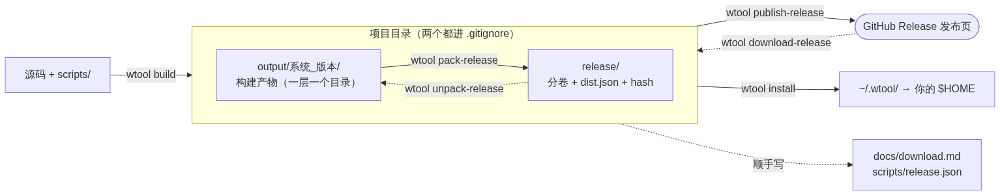
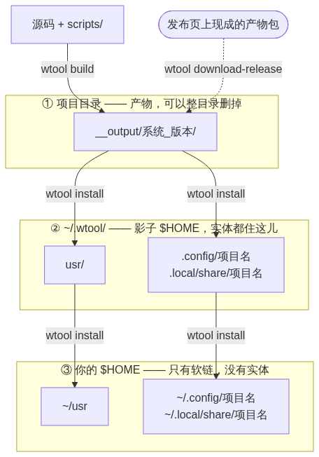

# wtool

把一堆零散的个人配置和工具——shell、终端、编辑器、主题——用一条命令装到一台新机器上。

这不是一个软件，是一套**管理方式**：所有配置以独立的小项目形式存在，各自放在自己的 Git 仓库里，由一个叫 `wtool` 的小引擎统一安装、构建、发布。

> 这份文档讲**怎么用**；每条规则**为什么**这么定（软链、记账、三层产物、发布契约……）
> 在 [`原理.md`](原理.md)；每条命令的参数和细节在 [`guide.md`](guide.md)。

**只想赶紧把包拿到手？** 不用 `git`、只有浏览器也行 —— 下载入口在 [§0.1 下载 / 获取](#01-下载--获取)。

---

## 0. 先拿到一个工作区

拿到工作区有两条路，**选一条就行** —— 两条路拿到的东西一样，后面的安装步骤（§0.1 的 ④）也完全一样：

- **下包**：不用 `git`，浏览器上点几下 → [§0.1 下载 / 获取](#01-下载--获取)（**下载入口在这一节**）
- **用 git**：`repo init` + `repo sync` 把全部仓库拉下来，以后更新一条命令 → [§0.2 用 git 拿全套](#02-用-git-拿全套推荐)

### 0.1 下载 / 获取

**不用 `git`、只在浏览器上点，也能把 `wtool` 和各个项目拿到手。** 这一节就是下载入口：
① `wtool` 本体去哪儿下、② 各子项目的发布包一览、③ 下下来之后怎么变成能用的东西。

#### ① `wtool` 本体（引擎）

`wtool` 这条命令住在 **`bootstrap`** 这个项目里 —— **不在你现在看的这个文档仓库里**
（这份文档是 `wtool-base`，里面只有文档）。引擎的仓库和发布页是：

| 是什么 | 地址 |
|---|---|
| 仓库 | <https://github.com/allinkernel/wtool-bootstrap> |
| 发布页（从这里下包） | <https://github.com/allinkernel/wtool-bootstrap/releases> |

两种拿法，任选一种：

```bash
# 有 git 的机器：把引擎克隆到工作区的 bootstrap/ 目录
mkdir -p ~/self/wtool
git clone https://github.com/allinkernel/wtool-bootstrap.git ~/self/wtool/bootstrap
```

**只有浏览器**：打开上面那个发布页，下最新那一版里的**源码包**，解开。
包里的第一层固定是 `wtool/`（和本机工作区目录叫什么无关），所以解开之后就有 `wtool/bootstrap/`。

只下这一个也够开张：解开后跑包里那个安装器（`cd wtool && ./bootstrap/install.sh` —— **路径以包里
实际有的为准**，有两种可能，见下面 ④），`wtool` 就能用了。别的项目按需再下。

> 地址不是猜的：工作区清单 `.repo/manifests/default.xml` 里 `path="bootstrap"` 那一行写的就是
> `allinkernel/wtool-bootstrap`，`bootstrap/` 仓库自己的 remote 也是它。

#### ② 各子项目的发布包一览

下面这张表是**引擎查到有发布包的项目** —— 点版本号去 Release 页，点文件名直接下载。

**表里没有的项目 = 引擎这次没查到它的包**（还没发过，或者 tag 对不上）。想找某个项目的包，
最稳的是直接点开那个项目的 Release 页（每个项目的仓库地址在 §1.7）；只想要源码就干脆走
§0.2 的 git 那条路。

> **下载这条路拿到的是"上一次发布那一刻"的工作区，不一定是最新源码**（现在线上这批包是
> 2026-09-15 发的）。要最新的源码，走 §0.2 的 git 那条路。

**这张表由 `wtool docs refresh` 重写，不要手改。** 它拿 `gh` 去 GitHub 查每个项目
**真实存在**的 release，照查到的结果重写整块（`wtool publish-release` 发布成功之后也会自动跑
一遍）；查不到东西时它**宁可不动这张表，也不拿空表覆盖**（见第 2.7 节）。
所以表里的链接都是线上真实存在的地址，版本号就是**最后一次刷表时线上那一版**。

<!-- >>> wtool:downloads >>> -->
<!-- 这一块由 `wtool publish-release` 自动重写，不要手改。 -->

每个项目的最新发布包都在它自己的 release 页面上。
全部下载并解开之后，你会得到一个完整的工作区目录。

| 项目 | 版本 | 包 | 大小 |
|---|---|---|---|
| `bootstrap` | [snapshot-2026-09-15](https://github.com/allinkernel/wtool-bootstrap/releases/tag/snapshot-2026-09-15) | [bootstrap-2026-09-15.tar.gz](https://github.com/allinkernel/wtool-bootstrap/releases/download/snapshot-2026-09-15/bootstrap-2026-09-15.tar.gz) | 86.4K |
| `lightmind` | [snapshot-2026-09-15](https://github.com/allinkernel/typora-LightMindTheme/releases/tag/snapshot-2026-09-15) | [themes-typora-lightmind-2026-09-15.tar.gz](https://github.com/allinkernel/typora-LightMindTheme/releases/download/snapshot-2026-09-15/themes-typora-lightmind-2026-09-15.tar.gz) | 1.2M |
| `os/ubuntu` | [snapshot-2026-09-15](https://github.com/allinkernel/wtool-os-ubuntu/releases/tag/snapshot-2026-09-15) | [os-ubuntu-2026-09-15.tar.gz](https://github.com/allinkernel/wtool-os-ubuntu/releases/download/snapshot-2026-09-15/os-ubuntu-2026-09-15.tar.gz) | 4.0K |
| `shell/oh-my-zsh` | [snapshot-2026-09-15](https://github.com/allinkernel/wtool-ohmyzsh/releases/tag/snapshot-2026-09-15) | [shell-oh-my-zsh-2026-09-15.tar.gz](https://github.com/allinkernel/wtool-ohmyzsh/releases/download/snapshot-2026-09-15/shell-oh-my-zsh-2026-09-15.tar.gz) | 3.0M |
| `shell/zsh` | [snapshot-2026-09-15](https://github.com/allinkernel/wtool-zsh/releases/tag/snapshot-2026-09-15) | [shell-zsh-2026-09-15.tar.gz](https://github.com/allinkernel/wtool-zsh/releases/download/snapshot-2026-09-15/shell-zsh-2026-09-15.tar.gz) | 2.2K |
| `terminal/fzf` | [snapshot-2026-09-15](https://github.com/allinkernel/wtool-fzf-binary/releases/tag/snapshot-2026-09-15) | [terminal-fzf-2026-09-15.tar.gz](https://github.com/allinkernel/wtool-fzf-binary/releases/download/snapshot-2026-09-15/terminal-fzf-2026-09-15.tar.gz) | 1.7M |
| `terminal/tmux` | [snapshot-2026-09-15](https://github.com/allinkernel/wtool-tmux-config/releases/tag/snapshot-2026-09-15) | [terminal-tmux-2026-09-15.tar.gz](https://github.com/allinkernel/wtool-tmux-config/releases/download/snapshot-2026-09-15/terminal-tmux-2026-09-15.tar.gz) | 4.5K |
| `tools/git-repo-sh-tools` | [snapshot-2026-09-15](https://github.com/allinkernel/wtool-repo/releases/tag/snapshot-2026-09-15) | [tools-repo-2026-09-15.tar.gz](https://github.com/allinkernel/wtool-repo/releases/download/snapshot-2026-09-15/tools-repo-2026-09-15.tar.gz)（发布时项目还叫 `tools/repo`，所以资产名是 `tools-repo-`） | 5.4K |
| `wtool-base` | [snapshot-2026-09-15](https://github.com/allinkernel/wtool/releases/tag/snapshot-2026-09-15) | [wtool-base-2026-09-15.tar.gz](https://github.com/allinkernel/wtool/releases/download/snapshot-2026-09-15/wtool-base-2026-09-15.tar.gz) | 23.0K |

### bash（Linux / macOS / WSL）

```bash
mkdir -p ~/self && cd ~/self
curl -fL -o bootstrap-2026-09-15.tar.gz \
  https://github.com/allinkernel/wtool-bootstrap/releases/download/snapshot-2026-09-15/bootstrap-2026-09-15.tar.gz
curl -fL -o themes-typora-lightmind-2026-09-15.tar.gz \
  https://github.com/allinkernel/typora-LightMindTheme/releases/download/snapshot-2026-09-15/themes-typora-lightmind-2026-09-15.tar.gz
curl -fL -o os-ubuntu-2026-09-15.tar.gz \
  https://github.com/allinkernel/wtool-os-ubuntu/releases/download/snapshot-2026-09-15/os-ubuntu-2026-09-15.tar.gz
curl -fL -o shell-oh-my-zsh-2026-09-15.tar.gz \
  https://github.com/allinkernel/wtool-ohmyzsh/releases/download/snapshot-2026-09-15/shell-oh-my-zsh-2026-09-15.tar.gz
curl -fL -o shell-zsh-2026-09-15.tar.gz \
  https://github.com/allinkernel/wtool-zsh/releases/download/snapshot-2026-09-15/shell-zsh-2026-09-15.tar.gz
curl -fL -o terminal-fzf-2026-09-15.tar.gz \
  https://github.com/allinkernel/wtool-fzf-binary/releases/download/snapshot-2026-09-15/terminal-fzf-2026-09-15.tar.gz
curl -fL -o terminal-tmux-2026-09-15.tar.gz \
  https://github.com/allinkernel/wtool-tmux-config/releases/download/snapshot-2026-09-15/terminal-tmux-2026-09-15.tar.gz
curl -fL -o tools-repo-2026-09-15.tar.gz \
  https://github.com/allinkernel/wtool-repo/releases/download/snapshot-2026-09-15/tools-repo-2026-09-15.tar.gz
curl -fL -o wtool-base-2026-09-15.tar.gz \
  https://github.com/allinkernel/wtool/releases/download/snapshot-2026-09-15/wtool-base-2026-09-15.tar.gz
tar -xf bootstrap-2026-09-15.tar.gz
tar -xf themes-typora-lightmind-2026-09-15.tar.gz
tar -xf os-ubuntu-2026-09-15.tar.gz
tar -xf shell-oh-my-zsh-2026-09-15.tar.gz
tar -xf shell-zsh-2026-09-15.tar.gz
tar -xf terminal-fzf-2026-09-15.tar.gz
tar -xf terminal-tmux-2026-09-15.tar.gz
tar -xf tools-repo-2026-09-15.tar.gz
tar -xf wtool-base-2026-09-15.tar.gz
```

跑完 `~/self/wtool/` 就是一个完整的工作区。
接着 `cd ~/self/wtool && ./bootstrap/scripts/install.sh`（第一次要用完整路径，
它会把根目录的 `./install.sh` 等入口补齐，之后就能直接用短的了）。

### PowerShell（Windows 10 及以上自带 tar）

```powershell
$d = "$HOME\self"; New-Item -ItemType Directory -Force -Path $d | Out-Null; Set-Location $d
Invoke-WebRequest -Uri "https://github.com/allinkernel/wtool-bootstrap/releases/download/snapshot-2026-09-15/bootstrap-2026-09-15.tar.gz" -OutFile "bootstrap-2026-09-15.tar.gz"
Invoke-WebRequest -Uri "https://github.com/allinkernel/typora-LightMindTheme/releases/download/snapshot-2026-09-15/themes-typora-lightmind-2026-09-15.tar.gz" -OutFile "themes-typora-lightmind-2026-09-15.tar.gz"
Invoke-WebRequest -Uri "https://github.com/allinkernel/wtool-os-ubuntu/releases/download/snapshot-2026-09-15/os-ubuntu-2026-09-15.tar.gz" -OutFile "os-ubuntu-2026-09-15.tar.gz"
Invoke-WebRequest -Uri "https://github.com/allinkernel/wtool-ohmyzsh/releases/download/snapshot-2026-09-15/shell-oh-my-zsh-2026-09-15.tar.gz" -OutFile "shell-oh-my-zsh-2026-09-15.tar.gz"
Invoke-WebRequest -Uri "https://github.com/allinkernel/wtool-zsh/releases/download/snapshot-2026-09-15/shell-zsh-2026-09-15.tar.gz" -OutFile "shell-zsh-2026-09-15.tar.gz"
Invoke-WebRequest -Uri "https://github.com/allinkernel/wtool-fzf-binary/releases/download/snapshot-2026-09-15/terminal-fzf-2026-09-15.tar.gz" -OutFile "terminal-fzf-2026-09-15.tar.gz"
Invoke-WebRequest -Uri "https://github.com/allinkernel/wtool-tmux-config/releases/download/snapshot-2026-09-15/terminal-tmux-2026-09-15.tar.gz" -OutFile "terminal-tmux-2026-09-15.tar.gz"
Invoke-WebRequest -Uri "https://github.com/allinkernel/wtool-repo/releases/download/snapshot-2026-09-15/tools-repo-2026-09-15.tar.gz" -OutFile "tools-repo-2026-09-15.tar.gz"
Invoke-WebRequest -Uri "https://github.com/allinkernel/wtool/releases/download/snapshot-2026-09-15/wtool-base-2026-09-15.tar.gz" -OutFile "wtool-base-2026-09-15.tar.gz"
tar -xf bootstrap-2026-09-15.tar.gz
tar -xf themes-typora-lightmind-2026-09-15.tar.gz
tar -xf os-ubuntu-2026-09-15.tar.gz
tar -xf shell-oh-my-zsh-2026-09-15.tar.gz
tar -xf shell-zsh-2026-09-15.tar.gz
tar -xf terminal-fzf-2026-09-15.tar.gz
tar -xf terminal-tmux-2026-09-15.tar.gz
tar -xf tools-repo-2026-09-15.tar.gz
tar -xf wtool-base-2026-09-15.tar.gz
```

跑完 `$HOME\self\wtool` 就是一个完整的工作区。
<!-- <<< wtool:downloads <<< -->

> 上面这一段（表格 + bash / PowerShell 两版命令）也是**引擎生成的**，文件名和链接以它列出的为准；
> 里面的安装入口路径按**包里实际有的那个**来（见下面 ④，有两种可能）。另一条提醒：
> 一个项目的包放进一个目录 —— 别把几个项目的包混在一起（③ 末尾有原因）。

#### ③ 下下来之后：两条路，命令写全

一个项目的发布页里有两种包：

| 包 | 是什么 | 谁要 |
|---|---|---|
| **源码包** | 整个项目的目录树（包里第一层是 `wtool/<项目>/`） | 要自己编的、要改源码的；**拿到工作区**也是靠它 |
| **产物包** | 编好的东西（`__output/` 里那些）。大的项目会切成 `-vol00`、`-vol01`…，外加一份 `dist.json` 说明每一卷叫什么、按什么顺序拼 | 只想用、不想编的。现在线上真发过产物包的是 Neovim 那套：[`editor/astronvim_v5` 的 Release 页](https://github.com/allinkernel/wtool-astronvim_v5/releases) |

**路线 A：手动下（浏览器点，不用 `wtool`）**

1. 在表里（或各项目自己的 Release 页）把要的项目下下来；
2. 解开**源码包** → 得到工作区（第一层固定是 `wtool/`），`cd` 进去；
3. 装 `wtool` 自己：跑包里那个安装器（`./bootstrap/scripts/install.sh` 或 `./bootstrap/install.sh`，见下面 ④）；
4. 要**产物包**的项目，把包和 `dist.json`（有分卷的话还有全部分卷）放进该项目的 `__release/` 目录，然后：

```bash
wtool unpack-release <项目>   # 照 dist.json 校验 + 拼分卷 + 解到 __output/
wtool install        <项目>   # 登记 + 软链 + shell 集成
```

> `unpack-release` 只认**新格式**的 `dist.json`（里面有 `files` 段 —— 今天的 `wtool pack-release`
> 打出来的就是）。而**现在线上只有 Neovim 那套发过产物包，它那几版是更早的流程发的**
> （`dist.json` 里只有分卷），`unpack-release` 会明确拒绝这种老包 —— 那种包要用它 Release 页
> 自带的方式解：把 `dist.json`、`extract.sh` 和所有 `-volNN` 放在同一个目录，`sh extract.sh`
> 解开，然后照样 `wtool install editor/astronvim_v5` 收尾（**装还是 wtool 的事**，
> 那个脚本只负责把文件铺到位）。不想碰旧包就自己编：`wtool build editor/astronvim_v5`（见 §2.3）。

**路线 B：只下源码，release 交给 `wtool` 自己下（推荐，省手）**

前 3 步和路线 A 一样（下源码包 → 解开 → 装 `wtool`），然后：

```bash
wtool download-release <项目>   # 读项目里提交的 scripts/release.json → 下到 <项目>/__release/
wtool unpack-release   <项目>   # 校验 + 拼分卷 + 解到 __output/
wtool install          <项目>   # 装
```

- `wtool download-release` 不带参数敲：列出**哪些项目有现成的包**可下；一次全下用
  `wtool download-release all`。
- **前提是项目里提交了 `scripts/release.json`**（发布方发完一版要把它提交进仓库 —— 它就是
  "这一版该下哪些文件"的清单）。没提交的项目敲了会明说「没有 `scripts/release.json`」，
  那就走路线 A，或者自己编：`wtool build <项目>`（要编译器和网络，几十分钟到几小时）。

> ⚠️ **一个项目的包放进一个目录**（尤其是产物包：**不能改名** —— `dist.json` 是按名字校验
> 每一卷的）。表里那批包名带项目前缀、不会撞；但引擎**现在**打的包叫 `源码.zip` /
> `release.zip`，**不带项目名** —— 同一版里下好几个项目、又放在一起，就会互相覆盖。
> 分开存最省事；走路线 B 就完全不用管这件事。

#### ④ 解开之后：跑包里那个安装器

**先看 `bootstrap/` 里是哪个安装器** —— 包的年代不同，位置不一样，两个都对，跑你手上那个：

| 包里的路径 | 什么时候打的包 | 它做什么 |
|---|---|---|
| `bootstrap/scripts/install.sh` | 新流程（`scripts/` 重构之后） | 准备运行环境 → 自举引擎 → 补工作区入口 → 让 `wtool` 可用。**做完就停，不装任何项目** |
| `bootstrap/install.sh` | 2026-09 前后那一批（**线上现在这批就是**） | 自举引擎 → 补工作区入口 → 直接交给 `wtool bootstrap`，把项目一起装上（加 `--with-system` 连系统层也做） |

不管跑的是哪个，接着都是这几步（**第一次要用完整路径** —— 解压出来的工作区还没有根目录那几个
入口，安装器会顺手补齐；之后 `./install.sh` 就能直接用了）：

```bash
cd <工作区目录>                    # 比如 ~/self/wtool
./bootstrap/scripts/install.sh     # ← 旧包换成 ./bootstrap/install.sh
exec $SHELL                        # 让当前 shell 认识 wtool（或者重开一个终端）

wtool sudo-bootstrap               # 系统层：apt 包、/etc 下的文件。要 root；没有 sudo 就跳过
wtool bootstrap                    # 用户层：文件、软链、shell 集成（重复跑没有副作用）
```

（新的那个安装器只做上面表里写的四步，屏幕最后会把接下来该敲的命令直接打给你；旧的会一路装下去。）

> **安装说明只有这一处权威：本文档**（细节版是 [`guide.md`](guide.md)）。
> 子项目自己的 README 只讲「这个项目是什么、有哪些脚本」，不另写一套安装步骤。
> **项目里的 `scripts/install.sh` 也不要去自己敲** —— 那是 `wtool install` 的活：引擎负责给它
> 导好环境变量、按声明建软链、把"装过什么"记进账；自己敲等于绕过引擎，账对不上，以后卸不干净
> （见第 3.4 节）。

### 0.2 用 git 拿全套（推荐）

**先装 `wtool` 自己，再让它去装项目。** 一共五步：

```bash
# 0. 先有 git、python3，再拿到 repo 工具本身
#    （很多发行版直接有包：sudo apt install repo；没有就用下面这个 —— repo 就是一个 Python 脚本）
sudo apt install -y git python3 curl
mkdir -p ~/.local/bin
curl -fsSL -o ~/.local/bin/repo \
  https://raw.githubusercontent.com/allinkernel/wtool-git-repo/wsw/repo
chmod +x ~/.local/bin/repo
export PATH="$HOME/.local/bin:$PATH"      # 想长期生效就写进 shell 配置

# 1. 把仓库拿到本地（第一次）
repo init -u ssh://git@github.com/allinkernel/w_manifests.git -b wtool
repo sync

# 2. 装 wtool 自己 —— 会准备好运行环境（python3/git/…），然后停下
cd <工作区目录>
./install.sh

# 3. 让当前 shell 认识 wtool（PATH 是 shell 启动时定下的，所以要重读一次）
exec $SHELL
#    或者干脆重开一个终端

# 4. 装系统层的东西：apt 软件包、系统配置文件（换 apt 源之类）。这一步要 root
#    没有 sudo 的机器直接跳过它，前面几步照样成立（见下面「没有 sudo 的机器」）
wtool sudo-bootstrap

# 5. 装其余的项目：文件、软链、shell 集成。不需要 sudo，也不联网
wtool bootstrap
```

> **第 0 步为什么不能省**：`repo` 要用 `python3` 和 `git` 跑，而这两样正是第 2 步
> `./install.sh` 负责准备的东西 —— 先有鸡才有蛋，所以这一步得你自己来（就三条命令）。
> `repo` 官方也提供打包版本（Debian/Ubuntu 上是 `repo` 这个包），有就用系统的。

**第 4 步和第 5 步为什么分开？** 因为**要 sudo 的事和不要 sudo 的事不能混在一格里**。
第 4 步动的是整个系统（apt 包、`/etc` 下的文件），第 5 步动的只是你自己的家目录。
混在一条命令里，你看到一屏输出，分不清该修哪一头。

这条分工贯穿整套命令：**带 `sudo-` 前缀的才可能要 sudo，其余的命令永不要 sudo、永不联网。**
所以 `wtool uninstall` 不会去动 `/etc`——那是 `wtool sudo-uninstall` 的事。

**第 2 步为什么到那里就停？** 因为它只负责「让 `wtool` 这条命令能用」，
不装任何项目。这样失败原因清清楚楚：`install.sh` 挂了 = 系统环境问题
（缺依赖、源连不上）；后面几条挂了 = 某个项目自己的问题。

第 2 步跑完它会把后面该做什么直接打在屏幕上，不用回来翻文档。

**没有 sudo 的机器（公司机器很常见）照样能装。** 跑第 2 步（`./install.sh`）时，它一上来
先判断这台机器是哪种：本来就是 root / `sudo` 免密 / 有 `sudo` 但要密码 / 根本没有 `sudo`。
要密码时，**能确认你有 sudo** 它就会问一次（先把将要执行的命令打给你看）：输密码就继续，
直接回车就跳过要 root 的那部分。**装 wtool 自己（引擎 + `~/.wtool` + 软链）一个 root 都不需要** —— 没有 sudo
也能装完，之后 `wtool install <项目>` / `wtool bootstrap` 装 tmux、zsh 这些照样能用。
只有系统层（`wtool sudo-bootstrap` / `wtool sudo-install`）要 root —— 那时候再找管理员，
不耽误前面。

> wtool **不会为了判断去弹密码框**：它靠"你在不在 `sudo`/`wheel` 组"来判断
> （标准配置就是靠组给权限），所以"有 sudo、只是要密码"的机器它**认得出来** ——
> `./install.sh` 会在这里问你一次密码（回车 = 跳过要 root 的那部分，并把该装什么打给你看）。
> 跳过也不影响 wtool 本体：自己敲一遍它打出来的 `sudo apt-get install ...` 就行。
>
> 如果连 `python3` / `git` 都没有、又装不上（没有 sudo），它会明确告诉你
> "让管理员装这两个包"，然后**停在准备运行环境这一步**（不会装作装好了）——
> 因为规划器要 `python3`、读仓库要 `git`，这两样确实绕不过去。

**装包时屏幕会动，不是卡死。** 它准备运行环境、用 apt 装东西时，每 5 秒打一行心跳：

```
wtool-install:     还在装…（30 秒）  · Get:3 http://… 45.2 MB/120 MB
```

以前下载几分钟屏幕上什么都没有，看起来像卡死。看到这行就说明它还活着；
apt 最后一行在做什么，它顺手贴出来了。

**第 2 步里已经把 Tab 补全挂好了。** 装的是引擎自己那个项目（`wtool install bootstrap`），
它的环境变量块会带上补全脚本 —— 做完第 3 步（重开 shell）之后，`wtool` 后面按 Tab
列的是 wtool 自己的候选，而不是当前目录里的文件：

```bash
wtool <TAB>            # 列子命令（install / bootstrap / pack-release …）
wtool install <TAB>    # 列项目路径，外加 all
wtool install --<TAB>  # 列这个命令认的开关（--dry-run / --force / --prune …）
```

给不出候选时（比如参数本来就是路径）会退回补文件名，所以没破坏原来的习惯。
bash 和 zsh 各一份、行为一致；内部命令（`_layer-save` 这种下划线开头的）不进候选，
这台机器没有 sudo 时 `sudo-*` 那几个命令也不进候选。用法细节见第 2.2 节。

**不想在真机上试？** 用容器跑一遍（`--network=host` 不能省：容器里的
`127.0.0.1` 只有在这个网络模式下才是宿主自己，脚本靠它自动接上宿主代理）：

```bash
# 从头走一遍，每一步自己决定（等价于"刚 repo sync 完"）
docker run --rm -it --network=host -v "$PWD":/wtool:ro \
  ubuntu:24.04 bash /wtool/bootstrap/scripts/container-raw.sh

# 或者一步到位，直接给一个装好的环境
docker run --rm -it --network=host -v "$PWD":/wtool:ro \
  ubuntu:24.04 bash /wtool/bootstrap/scripts/container-shell.sh
```

（`$PWD` 要换成工作区目录；两个容器脚本的差别见第 3.3 节。）

> **怎么看下面这些表**：✅ = 现在就能用；🚧 = 已经设计好、还没实现（敲它会报
> "不认识这条命令"）。这份文档只写**已经成立**的东西 —— 还在做的是什么、
> 做到哪了，看工作区里 `harness/BACKLOG.md`（那是唯一的进度来源，不在这份文档里
> 维护第二份，免得两边说法不一样）。

---

## 1. 它是怎么工作的

### 1.1 三个阶段，一张图

在新机器上重建开发环境，麻烦的从来不是"装"这个动作，而是四个副作用：
**装过什么记不住、装在哪儿说不清、装错了撤不掉、换台机器得重来一遍**。

`wtool` 把这件事拆成三个阶段，每个阶段的输入输出都不重叠：

```
  ① 产出 ── 需要网络；自己编还需要编译器
  ┌───────────────────────────┬──────────────────────────────────┐
  │ wtool build             自己编（编什么由项目说了算）         │
  │ wtool download-release  从发布页把包下到项目的 __release/    │
  │ wtool unpack-release    校验 + 解开，写进 __output/          │
  │ （后两条连起来 = 下别人编好的，结果和 build 一样）           │
  └───────────────────────────┬──────────────────────────────────┘
                             │ 写
                             ▼
  ┌──────────────────────────────────────────────────────────────┐
  │ __output/ —— 产物的中转站                                    │
  │ （不进 Git，可以整个目录拷到别的机器）                       │
  └───────────────────────────┬──────────────────────────────────┘
                             │ 读（install 是唯一的读者）
                             ▼
  ② 铺设 / ③ 打包发布
  ┌──────────────────────────────────────────────────────────────┐
  │ wtool install          铺进 ~/.wtool ← 断网也能跑            │
  │ wtool pack-release     __output/ → __release/（打成两个包）  │
  │ wtool publish-release  __release/ → 发布页 ← 需要网络        │
  └──────────────────────────────────────────────────────────────┘
```

一句话记住：**「编」和「下」产出同一个东西，装只认那个东西。**

所以：

- 换台机器，只要有 `__output/`，**不用重编**；
- `install` 跑得再多次也不会产生新东西，**可以随便重跑**；
- 卸载 = 把 `install` 铺出去的东西收回来。

### 1.2 命令速查

**每条命令都要能回答三个问题：要 sudo 吗、碰网络吗、能撤吗。**
下面就是这张表（命令后面写 `<路径>` 的，指的是**项目目录**，比如 `terminal/tmux`）。

**产出 `__output/`**

| 命令 | 做什么 | 要 sudo 吗 | 碰网络吗 | 可撤吗 |
|---|---|---|---|---|
| `wtool build <路径>` | 自己编：编译源码、拉插件、装语言服务，结果写进项目的 `__output/` | ❌ | ✅ | 删掉 `__output/` 就没了 |
| `wtool download-release <路径>` | 从发布页**只下载**：把别人编好的包下进项目的 `__release/`（逐个校验校验值） | ❌ | ✅ | 删掉 `__release/` 就没了 |
| `wtool unpack-release <路径>` | 把 `__release/` 里下好的包**校验 + 解开**，写进 `__output/` 的对应位置 | ❌ | ❌ | 同上 |

> 「下载」和「解开」是两条命令，可以分开跑：下载中断了重跑会跳过已下好的（校验值对得上就不重下），
> 解开失败也不会留下半个 `__output/`。「自己编」和「下载 + 解开」产出**完全相同的东西**。

**安装到系统**

| 命令 | 做什么 | 要 sudo 吗 | 碰网络吗 | 可撤吗 |
|---|---|---|---|---|
| `wtool install <路径>` | 把 `__output/` 铺进 `~/.wtool/usr`，再在 `$HOME` 里建软链、加 shell 集成 | **❌ 永不要** | **❌ 永不联网** | **完全可逆**，一条命令原样撤回 |
| `wtool uninstall <路径>` | 撤销 `install` | **❌ 永不要** | ❌ | —— |
| `wtool sudo-install <路径>` | 装系统软件包、改系统文件（换 apt 源之类） | ⚠️ **可能要** | ✅ | ⚠️ apt 包撤不干净；`/etc` 下的文件可以还原 |
| `wtool sudo-uninstall <路径>` | 撤销 `sudo-install`：卸载 apt 包 + 还原 `/etc` | ⚠️ **可能要** | ❌ | —— |

**打包与分发**

| 命令 | 做什么 | 要 sudo 吗 | 碰网络吗 | 可撤吗 |
|---|---|---|---|---|
| `wtool pack-release <路径>` | 打成**两个包**（源码包 + 产物包）写进项目的 `__release/`，各带一个校验文件 | ❌ | ❌ | 删掉 `__release/` 就没了 |
| `wtool unpack-release <路径>` | 在另一台机器上把包**校验 + 解开**（大项目是分卷的），解到 `__output/` | ❌ | ❌ | 同上 |
| `wtool publish-release [<路径>]` | **只上传**：把 `__release/` 里的东西传到项目自己的 GitHub Release 页，然后写下"这一版有什么"的下载声明 | ❌ | ✅ | 已经被人下载走的收不回来 |
| `wtool docs refresh` | 重刷这份 README 里「下载 / 获取」那张发布包一览表：拿 `gh` 去 GitHub 查每个项目**真实存在**的 release，照它重写（§0.1 的 ② 那一块就是它写的） | ❌ | ✅（要 `gh` 且已登录） | 改的是文档，`git checkout` 就能回退 |

> `wtool docs` 单独敲、`wtool docs refresh`、`wtool refresh-downloads` —— **三个入口同一条命令**。
> 它不在 `wtool --help` 的清单里，平时也不用记：`wtool publish-release` 发成功之后会自动跑一遍。
> 什么时候需要手动跑、跑不动怎么查，见第 2.7 节。

**层（只有容器构建的项目才有，比如 Neovim 那套）**

| 命令 | 做什么 | 要 sudo 吗 | 碰网络吗 | 可撤吗 |
|---|---|---|---|---|
| `wtool unpack-layer <路径>` | 把 `__layer/` 里的层镜像解成**安装产物**（写进 `__output/`，不需要 docker） | ❌ | ❌ | 删掉 `__output/` 就没了 |
| `wtool push-layer <路径>` | 把 `__layer/` 里的层镜像推到镜像仓库（要比 GitHub 快的那条通道；本机要 docker） | ❌ | ✅ | 已经推上去的收不回来 |
| `wtool pull-layer <路径>` | 从镜像仓库把层镜像拉到 `__layer/`（**目标机不需要 docker**） | ❌ | ✅ | 删掉 `__layer/` 就没了 |

> **层是项目的资产**：`wtool build` 编出来的层镜像住在项目的 `__layer/` 里，
> `unpack-layer` 把它变成能装的产物，`push-layer` / `pull-layer` 让层走镜像仓库到另一台机器。
> 另有两条 **`wtool _layer-save` / `wtool _layer-load`**（下划线开头 = 内部命令）：
> 引擎构建时自己调、排查时才有用，**不在上面的速查表里，也不在看板上**。

**批量**

| 命令 | 做什么 | 要 sudo 吗 | 碰网络吗 | 可撤吗 |
|---|---|---|---|---|
| `wtool bootstrap` | 所有项目 `install` 一遍 | ❌ | ❌ | 逐个 `uninstall` 即可 |
| `wtool sudo-bootstrap` | 所有项目 `sudo-install` 一遍 | ⚠️ 可能要 | ✅ | 同上，逐个项目来 |

**检查与修复**

| 命令 | 做什么 | 要 sudo 吗 | 碰网络吗 | 可撤吗 |
|---|---|---|---|---|
| `wtool check [<路径>\|all]` | 三者对比：**声明**（`wtool.xml`）、**日志**（装过什么）、**磁盘**（现在有什么） | ❌ | ❌ | 只看不动 |
| `wtool repair [<路径>\|all]` | 修 `check` 报出来的问题（补软链、清多余记录） | ❌ | ❌ | 只按 `check` 的结果修，不引入新东西 |

**销毁**

| 命令 | 做什么 | 要 sudo 吗 | 碰网络吗 | 可撤吗 |
|---|---|---|---|---|
| `wtool kill-self-forever` | 删掉 wtool 的一切痕迹（**含状态记录**）。会让你逐字输入一句全大写确认，并先列清删什么、不删什么 | ❌ | ❌ | ❌ **不可撤，这就是它的语义** |

**信息类（只看不动）**

| 命令 | 做什么 |
|---|---|
| `wtool` | 不带参数跑一下 = 第 1.5 节那张能力总览表 |
| `wtool doctor` | 环境诊断（版本、系统、状态目录、缺什么） |
| `wtool status` | 不带项目 = **登记表 + 软链检查**：`$HOME` 里登记的软链还在不在（全在就报条数），顺带把"哪个项目装了哪些落点"列出来 |
| `wtool status <项目>` | 看板上某一格看不懂？逐列给你状态 + 对应命令 + 依据（第 1.5 节） |
| `wtool validate <路径>` | 检查某个项目的 `wtool.xml` 写得对不对 |
| `wtool init <目录>` | 新建一个 wtool 项目 |
| `wtool version` | 打印版本 |

**会动手的那些命令**（`build` / `download-release` / `unpack-release` / `install` / `uninstall` /
`sudo-install` / `sudo-uninstall` / `pack-release` / `publish-release` / `unpack-layer` /
`push-layer` / `pull-layer` / `bootstrap` / `sudo-bootstrap` / `repair`）都支持 `--dry-run`：
先打印计划、不真的动系统。

**"永不要 sudo、永不联网"不是口号，它是可逆性的实现方式。** 只要 `install`
不产生任何新的外部依赖，"撤销"就是把铺出去的东西删掉这么简单。
一旦它偷偷开始下载或编译，撤销就成了一句空话——所以需要网络和编译器的活
全在 `build` / `download-release` 里，需要 root 的活全在 `sudo-*` 里。

> apt 装的系统包**没有记账**，所以严格来说撤不回来。
> `sudo-uninstall` 能做的：把装的包卸掉、把改过的 `/etc` 文件从备份还原回去。
> 这就是为什么它必须单独一条命令——让"撤不干净"这件事有个明确的入口，
> 而不是混在 `install` 里假装它可逆。

### 1.3 `__output/` / `__release/` / `__layer/` 是什么

这三个目录都是**跑出来的**，不是仓库自带的源码目录 —— 所以名字前面是两个下划线
（`__`），`ls` 一眼就能和源码分开。**它们永远不进 Git，删掉也能重新产出。**

**`__output/`（产物目录）**：每个需要产出的项目，在自己目录下都有一个 `__output/` 目录，
它是**产物的唯一落脚点**。**`__release/`（包的中转站）** 就在它旁边：
`pack-release` 打好的包放在这儿，从发布页下载的包也下到这儿。
**`__layer/`（层仓库）** 只有容器构建的项目才有：`wtool build` 编出来的层镜像住在这里，
它是一份**完整运行时**（`__output/` 是滤过的安装产物，见 [`原理.md`](原理.md) §8）。

```
<项目>/
├── wtool.xml            项目声明
├── scripts/             这个项目专属的动作脚本，只有两种
│   ├── build.sh         自己编：产物写进 __output/
│   ├── install.sh       通用机制铺不了的安装步骤
│   └── release.json     "这一版发布了什么"的下载声明（发布后生成，要进 Git）
├── docs/
│   └── download.md      给人看的下载页，README 里指向它（打包时生成，要进 Git）
├── __output/            ← build / unpack-release / unpack-layer 的产物，不进 Git
│   └── ubuntu_22/       按"系统_版本"分目录
│       ├── main/        底座：主程序 + 基础配置
│       └── lang/        语言增量包，依赖 main
│           └── cpp/ python/ java/ rust/ go/ lua/
├── __release/           ← 包的中转站，不进 Git
│   ├── xxx-源码.zip     整个项目（不含这三个目录）
│   ├── xxx-源码-hash.txt
│   ├── xxx-release.zip  产物包：__output/ 里的东西（大项目切成 -vol01、-vol02…）
│   ├── xxx-release-hash.txt
│   ├── dist.json        这一份怎么拼：每一卷叫什么、多大、校验值是多少
│   └── .source          内部标记：这份包是"刚打的"还是"刚下的"
└── __layer/             ← 层镜像（只有容器构建的项目），不进 Git
    └── ubuntu_22/       一个目标系统一个目录，里面是标准的镜像布局
```

> **为什么带 `__` 前缀**：`output/`、`release/`、`layer/` 这样的名字，`ls` 时分不清
> 是"跑出来的"还是仓库里的源码目录（别的项目里 `release/` 常是源码的一部分）。
> 加上 `__` 就只有一种读法：**机器特定、可以随时删掉重建**。

> **老工作区里的旧目录不会被自动改名。** 引擎只认新名字，老名字当它不存在 ——
> 明明产出过，看板还是显示「待产出」。它不会替你搬，自己搬一下就行：
> `mv output __output`、`mv release __release`、`mv layer __layer`
> （都在项目目录下执行），或者干脆重跑一遍 `wtool build` /
> `wtool download-release` + `wtool unpack-release`。
> **`wtool check` 认得出旧目录时，会把该敲的 `mv` 直接打给你**（只提示、绝不自动搬：
> 目录名是你的决定，而且可能有命令正在往里写）。它认四种：
> 上一版的 `output/` → `mv output __output`、`layer/` → `mv layer __layer`，
> 以及更早的构建产出 `release/` → `mv release __output`、打包产出 `publish/` → `mv publish __release`。
> 新名字已经在的时候它不会再喊（你搬了一半，它不烦你）。

**`__output/` 的四条规则**：

| 规则 | 为什么 |
|---|---|
| **`__output/` 不进 Git** | 它是机器特定的二进制产物，跟着仓库走只会把仓库撑爆 |
| **自己编、和下载解开，写到完全相同的路径** | 这是两条路等价的**唯一**实现方式 |
| **`install` 只读它，不写它** | 产物层和安装层分开，重装不用重建 |
| **整个目录可以搬走** | 拷到另一台机器 + `wtool install`，环境就复现了 |

**为什么按"系统_版本"分目录？** 编译出来的程序依赖系统的基础库（glibc）。
在 Ubuntu 22.04 上编的在 20.04 上跑不起来，反过来可以 —— 基础库只保证往前兼容。
所以每个目标系统单独出一份。**在最老的那个系统里编，一张包能通吃所有更新的系统。**

> 这句话对"我们自己编出来的东西"成立。**有个例外**：如果项目还要下**别人预先编好的**
> 二进制，那些二进制的底线由别人怎么编决定，可能比你的构建系统还新。
> 这类项目要在构建时逐个检查，超线的直接让构建失败，而不是发一个装上才发现不能用的包。

**`pack-release` 为什么要打两个包？** 因为你可能只需要其中一个：

- **源码包**（整个项目）——给"要自己编"的机器，或者存档
- **产物包**（`__output/` 里的东西）——给"只要用"的机器，
  它**自带编译好的程序**，解开就能用，不需要源码、不需要编译器

装到别的机器上时，**只需要产物包**。项目大到一个包传不完的时候，
产物包会切成若干分卷，放在项目的 `__release/` 里，旁边配一份 `dist.json` 说明每一卷叫什么、
多大、校验值是多少——`wtool unpack-release` 照着它校验和拼接，不需要人记顺序。

**这几个动作拼起来是一条闭环**，而且可以当成一条断言来验：

```
pack-release → unpack-release   ≡   repo sync 之后 build 一遍   ≡   repo sync 之后 download-release + unpack-release
```

**每条命令跟这两个目录的关系**（图源 `.pic/commands.mmd`）：



一句话读法：**只有 `build` 和 `unpack-release` 往 `__output/` 里写；
`pack-release` 往 `__release/` 里写，`download-release` 把包下进 `__release/`；
`install` 只读 `__output/`，`publish-release` 只读 `__release/`。**

#### 发布和使用，各走一遍

**发布方**（有源码、编得出来的那台机器）：

```bash
wtool build editor/astronvim_v5             # 源码 → __output/
wtool pack-release editor/astronvim_v5      # __output/ → __release/（打成包）
wtool publish-release editor/astronvim_v5   # __release/ → GitHub Release（**只上传**）
```

`publish-release` 传完之后写一份 `scripts/release.json`：这一版发了什么、
每个文件多大、校验值是多少。**这份文件是文本，要提交进仓库** ——
它就是下一台机器"该下哪些文件"的唯一依据。

**使用方**（只想用、不想编的那台机器）：

```bash
wtool download-release editor/astronvim_v5  # 读提交在项目里的下载声明 → 包下到 __release/
wtool unpack-release   editor/astronvim_v5  # 校验 + 解开 → __output/
wtool install editor/astronvim_v5           # 装
```

**为什么下载声明要提交进仓库？** 一是刚 `repo sync` 下来就知道"这个项目有没有现成的包"，
不用先联网去问发布页；二是**校验值的可信来源**：校验值只能证明"我下到的文件没坏、
和清单里写的一致"，**不能证明"这是作者发的"** —— 发布页和清单一起被换掉是防不住的。
清单放在仓库里（要改就得改提交历史，看得见）才挡住了这一层。
再往上（有人连你的 GitHub 账号一起换掉）今天**没有**防 —— 那要靠签名，现在没做。

`publish-release` 跑完会把该提交的东西打出来提醒你，但**不替你 commit**。

### 1.4 装的东西放在哪：三层

这是整套设计里最值得记住的一件事 —— **每一层只放一种东西**，
而且**每一层只由一条命令负责搬运**。



> 图源是 `.pic/layers.mmd`（Mermaid 文本），改了跑 `sh .pic/render.sh` 重新生成 PNG。
> 纯文本环境看下面这张对照表是一样的。

**`~/.wtool/` 是"影子家目录"**：它按 XDG 规范一一对应你的家目录，只是东西都住在里面。

```
你的 $HOME                      ~/.wtool/
~/.config/astronvim_v5     ←→   ~/.wtool/.config/astronvim_v5
~/usr                      ←→   ~/.wtool/usr
~/.tmux.conf               ←→   ~/.wtool/.tmux.conf
```

路径长得一模一样，所以"这个文件从哪来的、删了会少什么"一眼就能看出来。
**编译产物、下载产物统一放在 `~/.wtool/usr/` 这一格**，`~/usr` 就是它接回 `$HOME`
的那条软链——`~/usr/bin/nvim` 和 `~/.wtool/usr/bin/nvim` 是同一个东西。
（早先的版本用的是 `~/.wtool/config/xxx` 这种名字，两边对不上，
需要对着文档查——现在不用了。）

**反过来也成立**：`~/.wtool/` 下面**不会出现你 `$HOME` 里没有的路径**。
引擎自己用的东西都关在 `~/.wtool/` 里，**分两处**：引擎本体（自举下来的那份）
在 `~/.wtool/bootstrap`，中转软链和临时文件在 `~/.wtool/wtool-work-dir/` ——
后者是唯一一个故意不像家目录的目录。

**你的家目录里不该多出一个实体文件。** 所以卸载是干净的：
`wtool uninstall <项目>` 把②里的实体和③里的软链一起撤掉，家目录回到装之前。

配置文件和 shell 集成也走这条路：每个项目贡献的环境变量收在 `~/.wtool/.zshrc` 里，
你的 `~/.zshrc` 里只会多出**一小段 loader** 指过去，而不是每个项目各插一段。
（用 bash 的人对应 `~/.wtool/.bashrc`，两个 shell 各有一份，行为一致。）

**引擎自己用的东西**分两处：**自举**下来的引擎在 `~/.wtool/bootstrap`（一条指向工作区
`bootstrap/` 的软链），**中转软链**和临时文件在 `~/.wtool/wtool-work-dir/` —— 目录名就是它的用途。**状态记录**（谁装过、谁发布过）在 `~/.local/state/wtool/`，
这个位置是 XDG 标准给"状态"用的，你不会顺手把它当缓存删掉。

### 1.5 能力和进度：那张表

**每个项目里有一个 `wtool.xml`。有它 = 这是个 wtool 项目；没有 = 就是一堆文件，不参与 wtool。**
没有第二种判据 —— 不用问"这个目录算不算项目"，看有没有那个文件就行。

`wtool.xml` 用几行 XML 说清楚"我有哪些文件要被 shell 加载""哪些文件要软链到哪里"。
剩下的——建链接、写 shell 块、保证顺序、记录状态、支持卸载——全部由 `wtool` 负责。

只有通用机制表达不了的事情，项目才需要额外提供一个脚本，都放在项目自己的 `scripts/` 下。
**只有两种**：

| 脚本 | 什么时候需要 | 对应的命令 |
|---|---|---|
| `build.sh` | 这个项目要自己编（比如从源码编一个编辑器） | `wtool build <项目>` |
| `install.sh` | 装它需要通用机制做不到的步骤 | `wtool install <项目目录>` |

下载别人的包、打包上传**都不用写脚本**：那是引擎自带的命令
（`download-release` / `unpack-release` / `pack-release` / `publish-release`），
所有项目走同一条路。

**`build` / `install` 这两项能力，就由这两个脚本在不在决定**（`install` 还有一条来源：
`wtool.xml` 里声明了 `link` 或 `zshrc`/`bashrc` 也算有）。`wtool` 不带参数跑一下，
会看到一张表和四段计划。**下面这个例子来自一台有 sudo 的机器（13 列）**：

```
┌─────────────────────────┬──────┬────────┬────────┬────────┬──────────┬──────────┬────────┬────────┬────────┬──────────┬──────────┬──────────┐
│ 项目                    │ prio │  构建  │  安装  │  卸载  │ sudo安装 │ sudo卸载 │ 做gz包 │ 发布包 │ 下gz包 │ 解容器层 │ 推容器层 │ 拉容器层 │
├─────────────────────────┼──────┼────────┼────────┼────────┼──────────┼──────────┼────────┼────────┼────────┼──────────┼──────────┼──────────┤
│ bootstrap               │ 5    │ 不支持 │ 可执行 │ 未安装 │ 不支持   │ 不支持   │ 可执行 │ 已完成 │ 未发布 │ 不支持   │ 不支持   │ 不支持   │
│ os/ubuntu               │ 5    │ 不支持 │ 不支持 │ 不支持 │ 可执行   │ 未安装   │ 可执行 │ 已完成 │ 未发布 │ 不支持   │ 不支持   │ 不支持   │
│ terminal/tmux           │ 50   │ 不支持 │ 可执行 │ 未安装 │ 不支持   │ 不支持   │ 可执行 │ 已完成 │ 未发布 │ 不支持   │ 不支持   │ 不支持   │
│ editor/astronvim_v5     │ 70   │ 可执行 │ 可执行 │ 未安装 │ 不支持   │ 不支持   │ 可执行 │ 可执行 │ 未发布 │ 已完成   │ 可执行   │ 可执行   │
│ themes/typora/lightmind │ 100  │ 不支持 │ 不支持 │ 不支持 │ 不支持   │ 不支持   │ 可执行 │ 已完成 │ 未发布 │ 不支持   │ 不支持   │ 不支持   │
└─────────────────────────┴──────┴────────┴────────┴────────┴──────────┴──────────┴────────┴────────┴────────┴──────────┴──────────┴──────────┘
```

**表头是中文，一列只对应一条命令**（原来 `layer` 一列塞了三条命令，看的人分不清那个
「已完成」说的是哪条 —— 现在拆开了；长列名也不用再折行了）。

**`解gz包`（`wtool unpack-release`）没有独立列** —— 它是"装东西"那条路上的一步
（`__release/` → `__output/`），只在表格下边的"列名 → 命令"对照里出现。那个对照由
引擎自己算（`lib/wtool_plan.py` 的 `DASH_COLS` + `WT_CMD_OF`），**逐条写全、不省略**。

上面这个例子是一台**没装过几个项目的机器**上跑出来的，所以状态大多是"可执行"；
你自己装过的项目会显示"已完成"。`editor/astronvim_v5` 那一行正好三个「层」列
各是一种值：`解容器层` 已完成、`推容器层` / `拉容器层` 可执行。

**这台机器上没有 sudo 的话，表会少两列。** 看板**每次跑都重新探一次**这台机器能不能提权
（权限可能刚加上），判定的结果直接决定摆哪几列：

- **能提权**（本来就是 root / `sudo` 免密 / 刚输过密码、凭证还在缓存里）：13 列，
  `sudo安装` 和 `sudo卸载` 在其中；
- **不能**（没有 sudo；有 sudo 但要密码、而凭证已经过期；或者你设了 `WTOOL_SUDO=never`，
  见下）：**不列这两列**，11 列：

```
┌─────────────────────────┬──────┬────────┬────────┬────────┬────────┬────────┬────────┬──────────┬──────────┬──────────┐
│ 项目                    │ prio │  构建  │  安装  │  卸载  │ 做gz包 │ 发布包 │ 下gz包 │ 解容器层 │ 推容器层 │ 拉容器层 │
├─────────────────────────┼──────┼────────┼────────┼────────┼────────┼────────┼────────┼──────────┼──────────┼──────────┤
│ bootstrap               │ 5    │ 不支持 │ 可执行 │ 未安装 │ 可执行 │ 已完成 │ 未发布 │ 不支持   │ 不支持   │ 不支持   │
│ os/ubuntu               │ 5    │ 不支持 │ 不支持 │ 不支持 │ 可执行 │ 已完成 │ 未发布 │ 不支持   │ 不支持   │ 不支持   │
│ terminal/tmux           │ 50   │ 不支持 │ 可执行 │ 未安装 │ 可执行 │ 已完成 │ 未发布 │ 不支持   │ 不支持   │ 不支持   │
│ editor/astronvim_v5     │ 70   │ 可执行 │ 可执行 │ 未安装 │ 可执行 │ 可执行 │ 未发布 │ 已完成   │ 可执行   │ 可执行   │
│ themes/typora/lightmind │ 100  │ 不支持 │ 不支持 │ 不支持 │ 可执行 │ 已完成 │ 未发布 │ 不支持   │ 不支持   │ 不支持   │
└─────────────────────────┴──────┴────────┴────────┴────────┴────────┴────────┴────────┴──────────┴──────────┴──────────┘
```

这两列消失时，表下面的图例会写清原因和后果：

```
⚠️ 这台机器上没有 sudo → 少列了 sudo / sudo-un 两列。
   拿到 sudo 权限之后重跑 wtool 就会自动出现（每次都会现探）。
```

看板**不缓存**这个判定：权限或凭证一变（刚被加进免密 `sudo`、刚输过一次密码……），
不用重装、不用重开 shell，重跑一次 `wtool` 就看到了。

> **有 sudo 但要密码的机器**：照样列那两列（wtool 靠"你在不在 `sudo`/`wheel` 组"判断，
> 不会为了探测弹密码框）。真去跑 `wtool sudo-bootstrap` 时，系统会照常问你要密码。
> 判断实在不准（比如用了 `NOPASSWD`/`Cmnd_Alias` 之类的特殊配置），
> 用 `WTOOL_SUDO=yes` / `=never` 直接告诉它。

**`WTOOL_SUDO=never`：明确告诉 wtool"这台机器别碰 sudo"。** 公司机器上常用 ——
有些机器不是装不上 sudo，而是**根本不该用**。设了它，看板就当"没有 sudo"（11 列）、
Tab 补全也不提 `sudo-*`；它只影响 wtool 怎么判断，`sudo-*` 命令本身没被删掉。

**每一列就是一个命令**（中文列名 → 命令；表下面也有一行同样的对照，**逐条写全，不省略**）：

| 列名 | 对应命令 |
|---|---|
| `构建` | `wtool build` |
| `安装` | `wtool install` |
| `卸载` | `wtool uninstall` |
| `sudo安装` | `wtool sudo-install` |
| `sudo卸载` | `wtool sudo-uninstall` |
| `做gz包` | `wtool pack-release` |
| `发布包` | `wtool publish-release` |
| `下gz包` | `wtool download-release` |
| `解容器层` | `wtool unpack-layer`（`__layer/` → 安装产物 `__output/`，不联网、不要 docker） |
| `推容器层` | `wtool push-layer`（`__layer/` → 镜像仓库） |
| `拉容器层` | `wtool pull-layer`（镜像仓库 → `__layer/`） |

（`解gz包` = `wtool unpack-release` **没有独立列**，理由见上；它在表下边的对照里。）

> 三条「层」命令**各占一列**：`解容器层`（`unpack-layer`）的「已完成」看的是 `__output/` 里有没有
> 解出来的东西；而 **`push-layer` / `pull-layer` 推过没、拉过没，本机不记账** ——
> 它们最高只到「可执行」，真状态要去镜像仓库看。想知道某一格是怎么看出来的，
> 用 `wtool status <项目>`（见下）。

项目脚本只有 `build.sh` / `install.sh` 两种（看板里的 `构建` / `安装` 两列），
其余几列是**引擎**的命令 —— 摆出来是为了让你一眼看到"这个项目还能做什么"。
（`wtool _layer-save` / `_layer-load` 是**内部命令**，不在图例里、也不在 `--help` 的主清单里。）
**表下边那行对照里的 `sudo安装` / `sudo卸载` 两条，在没有 sudo 的机器上不出现** ——
那两列本来就没摆出来（见前面那张 11 列的表）。

**某一格看不懂、想知道"为什么是这个状态"：`wtool status <项目>`。** 它把看板第 1 段
按行摊开，每一列给你三样东西：**状态**、**对应的命令**、**依据**（这一格是从哪看出来的）。
项目写路径或者末段都行（`editor/astronvim_v5` 和 `astronvim_v5` 都认）：

```bash
wtool status editor/astronvim_v5
```

```
项目 editor/astronvim_v5（prio 70）  /home/<你>/self/wtool/editor/astronvim_v5
  一列一个命令；状态就是看板里那一格，依据 = 「这一格是怎么看出来的」。

┌────────────────┬────────┬────────────────────────┬────────────────────────────────────────────────────────────────────────────────┐
│ 列             │  状态  │ 对应命令               │ 依据（这一格是怎么看出来的）                                                   │
├────────────────┼────────┼────────────────────────┼────────────────────────────────────────────────────────────────────────────────┤
│ build          │ 可执行 │ wtool build            │ 有 scripts/build.sh；__output/ 里有 1 项                                       │
│ install        │ 可执行 │ wtool install          │ 有 scripts/install.sh；安装记录 0 条                                           │
│ uninstall      │ 未安装 │ wtool uninstall        │ 安装记录 0 条 → 现在没什么可撤的                                               │
│ sudo           │ 不支持 │ wtool sudo-install     │ wtool.xml 里没有系统层声明（sysfile/source/task）                              │
│ sudo-uninstall │ 不支持 │ wtool sudo-uninstall   │ 已装系统文件 0 个                                                              │
│ pack           │ 可执行 │ wtool pack-release     │ __output/ 里有 1 项                                                            │
│ publish        │ 可执行 │ wtool publish-release  │ 发布记录 0 条（还没发过）                                                      │
│ download       │ 未发布 │ wtool download-release │ 仓库里没有 scripts/release.json → 还没发布过，没东西可下                       │
│ unpack-layer   │ 已完成 │ wtool unpack-layer     │ build/layers.tsv 在；__layer/ 有 1 个 target；解出来 10 份 OWNED.tsv           │
│ push-layer     │ 可执行 │ wtool push-layer       │ build/layers.tsv 在；__layer/ 有 1 个 target（推没推过本机不记，去镜像仓库看） │
│ pull-layer     │ 可执行 │ wtool pull-layer       │ build/layers.tsv 在 → 可以从镜像仓库拉（拉下来会覆盖 __layer/）                │
└────────────────┴────────┴────────────────────────┴────────────────────────────────────────────────────────────────────────────────┘

  · 想知道某条命令**到底会做什么**：wtool <命令> editor/astronvim_v5 --dry-run（不动手，只出计划）
  · 状态只有六种：不支持 / 可执行 / 待产出 / 已完成 / 未发布 / 未安装（和看板同一套）
  · push-layer / pull-layer 的「推过没、拉过没」本机**没有记录**（那两条命令不写 journal）——
    本机只能告诉你「能不能推」；真状态去镜像仓库看。
```

（`status` 是**只看不动**的命令：不写任何状态、也不碰你的 `$HOME`。）

表后面还有四段：`wtool install` 能装哪些、`wtool sudo-install` 能装哪些、
`wtool bootstrap` 这次会装哪些（按顺序、谁被跳过）、`wtool sudo-bootstrap` 会跑哪些。
再后面是两张图（安装 / 发布）。

`prio`（优先级）越小越先加载，决定环境变量块的顺序 —— 引擎要在最前面，所以是 5。

每一格是**六种状态之一**，终端里各有颜色：

| 状态 | 颜色 | 意思 |
|---|---|---|
| **不支持** | 红 | 这个项目没这项能力（比如纯配置项目不能 build） |
| **可执行** | 黄 | 现在就能跑 |
| **待产出** | 蓝 | 能力有，但 `__output/` 里还是空的 —— 先 `wtool build`，或者 `download-release` + `unpack-release` |
| **已完成** | 绿 | 跑过了 |
| **未发布** | 紫 | 只在 `download` 那一格出现：这个项目还没发布过（仓库里没有 `scripts/release.json`），所以没东西可下 |
| **未安装** | 青 | 只在 `uninstall` / `sudo-uninstall`（列头折成 `sudo` + `-un`）那两格出现：**现在没什么可撤的**（还没装）。它和「不支持」不是一回事 —— 后者是"这个项目根本没这项能力" |

`install` 和 `uninstall` 是**成对**的两列，`sudo` 和 `sudo-uninstall` 也是这样：

- **装之前**：`install` = 可执行，`uninstall` = 未安装（没东西可撤）；
- **装之后**：`install` = 已完成，`uninstall` = 可执行（现在撤得掉）。

`sudo` / `sudo-uninstall` 同理（`sudo-bootstrap` 跑过就会变绿）。**没有 sudo 的机器上这两列不摆出来**，
这条对应关系也就无从谈起 —— 见前面那张 11 列的表。

`install` 那一列显示的是**你这台机器上的进度**，所以它会变：装过一个项目就从黄变绿，
换台机器或者卸掉它又变回黄。（`build` / `sudo` 那两列同理：跑过一次就变绿。）

**这是一条流水线**：

```
产出（build，或者 download-release + unpack-release）  →  install
```

前置没做时 `install` 会**直接报错告诉你去跑哪条**，不会替你跑 ——
因为「自己编」和「下载别人编好的」是两个不该由工具替你做的决定。

【图片占位】

<!-- TODO: 在装好 wtool 的机器上执行 `wtool`，把输出截图保存为 .pic/table.png
     建议终端宽度 130 列以上（有 sudo 的机器上这张表 13 列，没有 sudo 就 11 列）、
     保留颜色，这样六种状态的区别看得出来。 -->

### 1.6 现在到哪一步了

**这一节原来是一张"实现进度表"，现在删掉了** —— 进度是**会过期**的东西，
而这份文档是给所有人看的：读者照着做的时候，看到的必须是"现在就能用"的东西，
不是一张写着 🚧 的愿望清单（那还是两份真相：实现了没实现，`BACKLOG.md` 说了算）。

上面 1.1–1.5 讲的机制**现在全部成立**：影子家目录（实体在 `~/.wtool`，
`~/usr` 那条软链在）、`install` 先跑项目脚本再铺 `$HOME` 软链、
`install` 永不要 sudo 也永不联网、发布下载是引擎的四条命令、
层那三条命令（`unpack-layer` / `push-layer` / `pull-layer`）也在，
`sudo-*` / `check` / `repair` / `kill-self-forever` 都在、语言层按需叠加。

想知道"还剩什么没做"，看工作区里的 `harness/BACKLOG.md`。

### 1.7 现在有哪些项目

**下面这张表就是全部的 wtool 项目**，判据只有一个：**目录里有 `wtool.xml`**（§1.5）。
顺序和裸跑 `wtool` 得到的那张表一致（按 prio 排）。

| 项目 | 仓库 | 一句话简介 |
|---|---|---|
| `bootstrap` | [wtool-bootstrap](https://github.com/allinkernel/wtool-bootstrap) | 引擎本体：`wtool` 命令、安装/卸载机制、清单解析、发布逻辑。其他项目都靠它 |
| `os/ubuntu` | [wtool-os-ubuntu](https://github.com/allinkernel/wtool-os-ubuntu) | Ubuntu 上要装的系统软件包清单，以及把 apt 源换成国内镜像 |
| `shell/oh-my-zsh` | [wtool-ohmyzsh](https://github.com/allinkernel/wtool-ohmyzsh) | oh-my-zsh 本体，带自己的定制和插件选择 |
| `shell/zsh` | [wtool-zsh](https://github.com/allinkernel/wtool-zsh) | zsh 自身的配置和补全别名 |
| `tools/git-repo-sh-tools` | [wtool-repo](https://github.com/allinkernel/wtool-repo) | `repo` 工具（管理多仓库的那个）和它的快捷命令（2026-10-04 由 `tools/repo` 改名） |
| `tools/android_repack` | [wtool-android_repack](https://github.com/allinkernel/wtool-android_repack) | Android 镜像"解包 → 改 → 重新打包"的流水线 |
| `tools/gerrit-gate` | [wtool-gerrit-gate](https://github.com/allinkernel/wtool-gerrit-gate) | 本机的代码检视闸门（Gerrit），改动要过它才进主线 |
| `tools/dsh-remote` | [wtool-dsh-remote](https://github.com/allinkernel/wtool-dsh-remote) | 不在电脑前时用手机接管会话 |
| `harness/dsh-conf` | [wtool-dsh-conf](https://github.com/allinkernel/wtool-dsh-conf) | 助手自己的配置：提示词、技能、profile |
| `terminal/tmux` | [wtool-tmux-config](https://github.com/allinkernel/wtool-tmux-config) | tmux 配置，外加一组显示 CPU/内存/磁盘/网络的小脚本 |
| `terminal/fzf` | [wtool-fzf-binary](https://github.com/allinkernel/wtool-fzf-binary) | fzf 的预编译二进制，省得每台机器重编 |
| `editor/astronvim_v5` | [wtool-astronvim_v5](https://github.com/allinkernel/wtool-astronvim_v5) | 一整套 Neovim 环境：编译 nvim、装插件、装语言服务器、打成发布包 |

**下面这些也在工作区里、也是独立的仓库，但不是 wtool 项目** —— 目录里没有 `wtool.xml`，
所以 `wtool install` / `wtool bootstrap` 不会碰它们：

| 仓库 | 为什么不是 |
|---|---|
| [wtool](https://github.com/allinkernel/wtool) —— 你现在看的这份文档 | 纯文档，没有任何"装上去"的东西 |
| [wtool-harness](https://github.com/allinkernel/wtool-harness) | 助手的笔记和 `AGENTS.md`，同样是纯文档 |
| [wtool-astronvim_v5_config](https://github.com/allinkernel/wtool-astronvim_v5_config) | 它是上一行 `editor/astronvim_v5` 那套环境的一部分，跟着那套一起发。🚧 将来会给它自己一份 `wtool.xml`，那时它才会单独出现在表里 |
| [neovim](https://github.com/neovim/neovim) | 上游仓库，我们既没权限推、也不能往里塞文件 |
| [typora-LightMindTheme](https://github.com/allinkernel/typora-LightMindTheme) | Typora 主题，只有素材和样式文件 |

> 这份列表是给人看的，**要准确清单以运行结果为准**：裸跑 `wtool` 就是那张表（§1.5）。
> 两边不一致时，以表为准 —— 表是拿目录里有没有 `wtool.xml` 现算出来的。

---

## 2. 怎么用

装完之后，`wtool` 命令就可以在任何目录下直接用了。

不过有几条命令要你告诉它**项目在哪**：`install` / `uninstall` / `sudo-install` /
`sudo-uninstall` / `validate` 认的是**项目目录**——在工作区根目录下写
`terminal/tmux` 就行，在别的地方要写全路径。（`install` / `uninstall` 还认**末段**：
`wtool install terminal/tmux`、`wtool install tmux` 都行。**没有 `--id` 这回事** ——
项目身份就是它的路径，见下面「改项目目录」。）`build` / `download-release` / `unpack-release` /
`publish-release` / `status` 同样宽松，直接写项目名（`terminal/tmux`，甚至只要末段 `tmux`）
也可以，在哪跑都认。

### 2.0.1 改项目目录：用 `wtool move`，别自己 `mv`

**项目的身份就是它在工作区里的路径**（没有单独的"项目 id"）。
所以**把目录改个名 = 换了一个项目**：链接、环境变量块、`wtool` 记的账都挂在旧路径上。

想改名就用这一条 —— 它一次做完"撤旧的、搬目录、按新路径装回来"：

```bash
wtool move terminal/tmux terminal/tmux2    # 旧路径 → 新路径
wtool move terminal/tmux terminal/tmux2 --dry-run   # 只看计划，什么都不动
```

自己 `mv` 会怎样：`wtool` 记的账留在旧路径上 —— 链接变成断的、环境变量静默失效、
下次 `install` 还会说落点被别人占着。**没走 `move` 就已经 `mv` 过**的话，
跑一句 `wtool check`：它会把这类"旧账"一条条列出来，照着提示
`wtool uninstall <旧路径> --no-script` 撤掉即可。

### 2.1 看总览

```bash
wtool
```

不带参数跑一下，就是第 1 节里那张表：哪些项目、各自能做什么、装过没有、发布过没有。

```bash
wtool doctor     # 表格 + 环境诊断（版本、系统、状态目录、缺什么）
```

### 2.2 装

```bash
cd <工作区目录>                        # install / uninstall 认的是项目目录，在工作区根目录最省事
wtool install terminal/tmux         # 装一个项目
wtool uninstall terminal/tmux       # 撤销，系统回到装之前
```

**这一节的命令都不需要 root。** 没有 sudo 的机器上 `wtool install <项目>` /
`wtool bootstrap` 照样能用 —— 只有下面那两条 `sudo-*` 才要 root（要的时候再找管理员）。

**按 Tab 让它告诉你有什么可装。** 装完 wtool 自己、重开过 shell 之后，
`wtool` 后面按 Tab 就是 wtool 自己的候选（不是当前目录的文件）：

| 你敲 | 补出什么 |
|---|---|
| `wtool <TAB>` | 子命令（`install` / `bootstrap` / `pack-release` …） |
| `wtool install <TAB>` | 项目路径（`terminal/tmux` 这种），外加 `all` |
| `wtool install --<TAB>` | 这个命令认的开关（`--dry-run` / `--force` / `--prune` …） |
| 参数是路径时 | 退回补文件名（和平时一样） |

bash 和 zsh 都有、行为一致。内部命令（`_layer-save` 这种下划线开头的）不进候选；
这台机器没有 sudo 时 `sudo-*` 也不进候选，和看板一个口径。

`install` 是完全可逆的。想先看看它会做什么：

```bash
wtool install terminal/tmux --dry-run
```

它会打印出计划（要建哪些链接、要写哪几段 shell 块），但不真的动系统。

**装一个项目实际发生两件事，顺序是有意的**（两件都是引擎替你做的，**你不用自己去敲那个脚本**）：

```
① 先跑项目自己的 scripts/install.sh   —— 把 __output/ 里的东西铺进 ~/.wtool
② 再按 wtool.xml 建软链              —— 把 ~/.wtool 里的东西接到你的 $HOME
```

先①后②不能反：②建的软链**指向**①铺出来的东西，反了就是先建一堆悬空链接。

一次把不需要你先决策的项目都装上（`wtool install all` 和 `wtool bootstrap` 是同一条路）：

```bash
wtool sudo-bootstrap     # 系统层：apt 包、/etc 下的文件。要 root；没有 sudo 就跳过这条
wtool bootstrap          # 用户层：文件、软链、shell 集成。不需要 sudo、不联网
```

需要「编还是下」的项目它会跳过，并把该跑的命令列给你——见 2.3。

【图片占位】

<!-- TODO: 在一台干净机器（或容器）上执行，把输出截图保存为 .pic/install.png
     wtool bootstrap
     截图建议包含开始几行和结束几行，能看出"按项目逐个处理"的结构。
-->

### 2.3 产出：自己编，或者下现成的

有些项目要产出东西才能用——要么自己编，要么直接下别人编好的（比如那套 Neovim 环境）：

```bash
wtool build                      # 列出哪些项目可以构建
wtool build editor/astronvim_v5  # 自己编（小时级）

wtool download-release                    # 列出哪些项目有现成的包可下
wtool download-release editor/astronvim_v5  # 从发布页下到 __release/（分钟级，只下载）
wtool unpack-release editor/astronvim_v5    # 校验 + 解开，写进 __output/
```

**两条路二选一，结果完全等价。** 两条路都产出到项目的 `__output/` 目录、放在同一个位置，
所以之后的 `wtool install` 根本不关心它是从哪来的。能下就下。
（**没有 `git`、只想手动下包**的那条路 —— 连"只下产物包再解开"的走法 —— 在 §0.1 的 ③。）

「下载」和「解开」是两条命令、各干一件事：`download-release` 只把包下到 `__release/`，
`unpack-release` 才校验分卷、按顺序拼起来、解到 `__output/`。中断了重来也不会坏 ——
已经下好的文件（校验值对得上）会跳过，不会重下几百兆。纯配置类的项目没有这一步。

### 2.4 打包与发布

**打包**（不联网，产出落在项目自己的 `__release/` 目录里）：

```bash
wtool pack-release editor/astronvim_v5
```

出来的是一对包——**源码包**（整个项目）和**产物包**（`__output/` 里的东西），
各配一个校验文件。大项目的产物包会切成若干分卷，外加一份 `dist.json` 说明每一卷。
同时写一份给人看的下载页 `docs/download.md`（提交进仓库，README 里指向它）。

**解包**（在另一台机器上，或者你想验一遍包是好的）：

```bash
wtool unpack-release editor/astronvim_v5
```

它照 `dist.json` 校验每一卷的校验值、按正确顺序拼起来、解到 `__output/`，然后你就能
`wtool install` 了。**装到别的机器上时只需要产物包**，不需要源码包。

**上传**（把 `__release/` 里的东西传到项目自己的 GitHub Release 页）：

```bash
wtool publish-release                 # 所有可发布的项目
wtool publish-release terminal/tmux   # 只发一个
wtool publish-release --dry-run       # 先看计划
```

它**只上传、不打包**（要发新版本就先 `pack-release`），传完之后写一份
`scripts/release.json`：这一版发了什么、每个文件的校验值是多少 ——
**记得把它提交进仓库**，那是别人 `download-release` 时的依据。

发布完成后，本文档 §0.1 的下载链接会自动更新成最新的 —— 那一段是发布时重写的，不用手动维护。

### 2.5 卸载：三条命令，别用 `rm -rf`

**`rm -rf ~/.wtool` 不是完整卸载。** 它只删掉了影子家目录里的实体，
你的 `$HOME` 里那些软链**还在**（全变成断链），`~/.zshrc` 里的 loader 块也还在。

正确的做法是三条命令，**管的东西不一样、权限也不一样**：

| 命令 | 管什么 | 要 sudo 吗 |
|---|---|---|
| `wtool uninstall all` | 撤销所有 `install`：`$HOME` 里的软链 + `~/.wtool` 里的实体 | ❌ |
| `wtool sudo-uninstall all` | 撤销所有 `sudo-install`：卸载 apt 包、还原 `/etc` 下的文件 | ⚠️ 可能要 |
| `wtool kill-self-forever` | 删掉 wtool 的一切痕迹，**含 `~/.local/state/wtool/` 里的状态记录** | ❌ |

`wtool uninstall` **不越权**：它不会去还原 `/etc`，因为那是 `sudo-uninstall` 的事。
反过来也一样。想只卸一个项目就把 `all` 换成项目目录。

**`kill-self-forever` 是第三条命令，因为它删的东西前两条都不碰**：状态记录
（谁装过、谁发布过）在 `~/.local/state/wtool/`，不在 `~/.wtool/` 里 ——
没有它，那本账永远留着。它会先列清**删什么、不删什么**，
再要求你**逐字输入一句全大写确认**，敲错一个字就什么都不做。

### 2.6 检查与修复

```bash
wtool check              # 全部项目：声明 / 日志 / 磁盘 三者对比
wtool check terminal/tmux
wtool repair all         # 修 check 报出来的
```

`check` 回答的是"我以为装了的东西，真的还在吗"：`wtool.xml` 里声明了什么、
日志里记着装过什么、磁盘上现在有什么——**三者对不上就报出来**。
`repair` 只按 `check` 的结果修，不会顺手引入新的东西。

**老工作区的目录改名也由 `check` 提示**：`__output/` / `__release/` / `__layer/`
是后来的名字，老的 `output/` / `release/` / `layer/` 不会被自动搬（看板只会显示「待产出」）。
`wtool check` 认出旧目录时会把该敲的 `mv` 直接打出来 —— **它只提示，绝不自动搬**
（目录名是你的决定，而且可能有命令正在往里写）。

```bash
mv output __output      # 在项目目录下执行；老的构建产出
mv release __release    # 老的打包产出
mv layer __layer        # 老的层仓库
```

### 2.7 其他命令

```bash
wtool doctor                        # 环境诊断（版本、系统、状态目录、缺什么）
wtool status                        # 不带项目：登记表 + 软链检查（登记的软链还都在吗）
wtool status <项目>                  # 给了项目：逐列说明某一格的状态、对应命令和依据（只看不动）
wtool validate <项目目录>            # 检查某个项目的 wtool.xml 写得对不对
wtool init <目录> [--priority N] [--all]   # 新建一个 wtool 项目
wtool docs refresh                  # 重刷 §0.1 那张发布包一览表（= wtool docs / wtool refresh-downloads）
wtool version
```

**`wtool status` 两种形态**（两个都留着，按你手里有没有项目名挑）：

- **不带参数** —— 快速体检：把登记过的软链逐条看一遍，缺了就报 `缺失: <路径>（项目 <项目路径>）`，
  全在就报一句 `所有登记的软链都在（N 条）`，最后附一张登记表（项目 / 种类 / 落点）。
  典型的用法是"我是不是把什么东西删掉了"。
- **带项目**（目录、项目路径、末段都行）—— 逐列给「状态 + 对应命令 + 依据」，
  用来看懂看板上某一格为什么是那个状态。

**`wtool docs refresh` 什么时候用**：§0.1 那张发布包一览表是自动维护的，`publish-release`
发成功之后会自己刷一遍，所以**平时不用管**。要手动跑通常是这几种：

- 在**别的机器**上发的版本：本机没跑 `publish-release`，没人替你刷；
- 上次发完那次自动刷失败了（当时没有 `gh`、或者没登录），事后补一次；
- 项目表变了（加了项目、改了 `wtool.xml` 里的发布声明），想让表跟着变；
- 想确认表里就是 GitHub 上的现状（它每次都现查，不看本地记录）。

跑之前要知道三件事（都是它的实际行为）：

1. **它要 `gh`（GitHub CLI）且已登录。** 没有 `gh` 就跳过并警告一句，不会硬失败。
2. **它改的是文档**（带 `<!-- >>> wtool:downloads >>> -->` 标记的那一块），
   改完是普通的工作区改动 —— `git diff` 能看、`git checkout` 能退。
3. **它拒绝用空表覆盖已有的表**：如果查到 0 个资产（`gh` 没登录、网络不通、
   release 被删都会这样），而文档里本来有下载表，它会警告并停手 ——
   防止一次网络故障把 30 条链接清空。确认确实要清空才加 `--force`。
4. **它查的是"今天"那一版**：tag 按每个项目的模板算（默认 `snapshot-%Y-%m-%d`，
   也就是当天日期）。所以**发布那天刷才刷得到东西** —— 当天没发过版本，就是第 3 条
   那个「查到 0 个资产」，表原样不动。`publish-release` 发布成功后自动跑的那一遍，
   正好是"今天发了版本"的情况，所以表总是跟着最新发布走。

`build` / `download-release` / `unpack-release` / `install` / `uninstall` / `sudo-install` /
`sudo-uninstall` / `pack-release` / `publish-release` / `unpack-layer` / `push-layer` /
`pull-layer` / `bootstrap` / `sudo-bootstrap` / `repair` / `kill-self-forever`
都支持 `--dry-run`：先打印计划、不真的动系统。
**`--dry-run` 时项目自己的 `scripts/install.sh` / `scripts/build.sh` 根本不会被执行** ——
引擎只打印"真跑的话会跑哪条脚本、带什么参数、在哪个目录、给什么环境变量"，
所以哪怕脚本自己没写 dry-run 支持，也不会有任何副作用。
`status` / `doctor` / `validate` 这些只看不动的没有这个开关；
`docs refresh` / `kill-self-forever` 也有 `--dry-run`（前者只打印"要刷哪个文档"，
后者只打印"会删什么、不删什么"）。

`repair` 和 `kill-self-forever` 分别在第 2.6、2.5 节。

`wtool` 不带参数跑一下就是第 1 节那张能力总览表。

---

## 3. 仓库里这些脚本分别干什么

项目里有一堆同名的 `.sh`，容易搞混。按"谁调用谁"分三层看就清楚了。

### 3.1 工作区根目录看到的

根目录那几个是**软链接**，指向真正的文件（`repo sync` 建出来的）：

| 根目录 | 实际是 | 干什么 |
|---|---|---|
| `install.sh` | `bootstrap/scripts/install.sh` | 装 **wtool 自己**（准备运行环境、自举引擎、建工作区入口、让 `wtool` 进 `PATH`）。**不装任何项目** |
| `uninstall.sh` | `bootstrap/scripts/uninstall.sh` | 把 wtool 自己卸掉 |
| `README.md` | `wtool-base/README.md` | 就是本文 |
| `guide.md` | `wtool-base/guide.md` | 完整手册 |

记住一句分工：**根目录的 `install.sh` 只负责让 `wtool` 这条命令出现**，
项目是靠 `wtool install` 装的。这是两件事。

### 3.2 引擎

| 文件 | 干什么 |
|---|---|
| `bootstrap/wtool.sh` | 引擎本体，`wtool` 命令就是它的软链。所有 `wtool xxx` 都进这里 |
| `bootstrap/lib/*.py` | 只**算**不写：扫项目、算计划、画表、算环境变量 |
| `bootstrap/lib/*.sh` | 只**写**不算：落盘、记账、建链接、生成 rc |

刻意分成两半（Python 推理、Shell 动手），这样"会发生什么"可以在动手之前
完整算出来——`--dry-run` 才有意义。

### 3.3 给容器用的两个脚本

工作区挂进容器时，这两个差别很大：

| 脚本 | 做什么 | 什么时候用 |
|---|---|---|
| `bootstrap/scripts/container-shell.sh` | 装系统依赖 → 装引擎 → 把你丢进 zsh（**剩下两步自己敲**：`wtool sudo-bootstrap` 再 `wtool bootstrap`） | 想马上得到一个能用的环境 |
| `bootstrap/scripts/container-raw.sh` | **什么都不装**，只挂工作区 → 进 bash；加 `--user <名字>` 则先建一个普通用户（密码 `root`、sudo 免密）再切进去 | 想从零走一遍，每一步自己决定 |

`container-raw.sh` 的状态等价于"刚 `repo sync` 完"：连 `python3` 和 `git`
都没有。这是**故意的**——装了它们 `wtool` 就能跑，可真机器刚同步完时本来
就没有，如实反映那个状态才不会被误导。进去之后它会打一份操作对照表。

```bash
# 从头走一遍（root 进去）
docker run --rm -it --network=host \
  -v ~/self/wtool:/wtool:ro \
  ubuntu:24.04 bash /wtool/bootstrap/scripts/container-raw.sh

# 以一个普通用户进去（推荐：真机上你就是普通用户，sudo 才用得着）
docker run --rm -it --network=host \
  -v ~/self/wtool:/wtool:ro \
  ubuntu:24.04 bash /wtool/bootstrap/scripts/container-raw.sh --user mindul

# 或者直接要一个装好的环境
docker run --rm -it --network=host \
  -v ~/self/wtool:/wtool:ro \
  ubuntu:24.04 bash /wtool/bootstrap/scripts/container-shell.sh
```

`--user <名字>` **只做三件事**（顺序有意义），然后 `su - <名字>` 切进去：

1. **建这个普通用户**：家目录 + bash、**密码 `root`**、`/etc/sudoers.d` 免密
   （uid 尽量对齐宿主，挂进来的工作区才不会被 git 说"别人的仓库"）
2. **测速挑 apt 源**：国内几个镜像站各下一个索引比速度，让你挑一个（不挑就自动
   选最快的）—— 结果记在新用户的 `~/.local/state/wtool/mirror.txt` 里，
   后面 `./install.sh` 直接接着用，**不再测第二遍**
3. **装 `sudo` 这个包**（ubuntu 基础镜像里没有它：有 sudo 组、没 sudo 命令）

**除此之外没有别的**：它不跑 `./install.sh`，也不装 python3 / git / curl / ansible，
更不碰工作区 —— 那些都是你进去之后照着提示自己敲的事。不带 `--user` 时行为
一个字没变（root 进去、这三件事一件都不做）。

两个脚本进来时都会**自动探测宿主机的代理**（默认探 `127.0.0.1:7897`）并接上。这一步不能省：`docker run` 不会把你 shell 里的代理变量带进容器，不接的话容器里是"裸网"，所有下载都失败，而人很容易把它误判成"网络坏了"。这也是 `--network=host` 不能省的原因——只有在 host 网络下，容器里的 `127.0.0.1` 才是宿主自己。不想要自动探测就加 `-e WTOOL_NO_PROXY=1`，代理不在默认端口就加 `-e WTOOL_HOST_PROXY=http://127.0.0.1:端口`。

**进去之后会看到的两件事**（别误判）：

- `./install.sh` 装包时每 5 秒打一行 `还在装…（N 秒）· <apt 最后一行>`。容器里下载本来就慢
  （走代理时更慢），以前屏幕上几分钟没动静，人以为卡死就把容器 Ctrl-C 了 —— 有这行就说明它还活着。
- 交给你的是**新开的 shell**（脚本最后 `exec bash -i`），所以 Tab 补全直接就能用：
  `wtool <TAB>` 列子命令、`wtool install <TAB>` 列项目路径（见 2.2）。

**看板列数取决于容器里这个用户能不能提权**：不带 `--user` 时你是 root，`--user` 建的那个
普通用户是 **sudo 免密**，两种都算"有 sudo"，看板是 13 列；想看"没有 sudo"的 11 列，
得用一个真没有 sudo 的用户（判定规则见 1.5）。

### 3.4 每个项目自己的 `scripts/`

项目目录下的 `scripts/` 是**这个项目专属**的动作，**只有两种**。
有没有某个文件本身就是一种声明——有 `build.sh` 才叫"能构建"：

| 文件 | 什么时候跑 | 干什么 |
|---|---|---|
| `build.sh` | `wtool build <项目>` | 自己编，**产物写进项目的 `__output/`** |
| `install.sh` | `wtool install <项目>` | 把 `__output/` 铺进 `~/.wtool/usr`；**不要**自己建 `$HOME` 软链、不要写 rc —— 那是引擎按 `wtool.xml` 干的（顺序上也保证：项目脚本跑完之后引擎才建 `$HOME` 软链） |
| `install.sh --uninstall` | `wtool uninstall <项目>` | 撤销上面做的 |

**这两个脚本只有引擎会跑，别自己去敲。** 引擎调它们的时候会导好环境变量
（`WTOOL_PROJECT_DIR` / `WTOOL_PREFIX` …）、按顺序铺实体和软链、并记下"装过什么"；
绕过引擎直接跑，账上没有这一笔，以后 `wtool uninstall` 就撤不干净。
（**安装步骤只有一处权威：本文档**，见 §0.1 的 ④；子项目自己的 README 不另写一套。）

**下载、打包、上传都不用项目写脚本**：`wtool download-release` / `unpack-release`
（取现成的包）和 `wtool pack-release` / `publish-release`（打包上传）是引擎自带的命令，
每个项目走的都是同一条路。老项目里的 `download.sh` / `publish.sh` / `extract.sh`
已经退休，看到它们可以当历史遗留。

另外两个**生成物**（不是脚本，是文本，要提交进仓库）：

| 文件 | 谁写 | 干什么 |
|---|---|---|
| `scripts/release.json` | `wtool publish-release`（上传成功后） | "这一版发布了什么"：每个文件的名字、大小、校验值。`download-release` 照它下 |
| `docs/download.md` | `wtool pack-release` | 给人看的下载页；项目 `README.md` 里留一行指过来就行 |

**「自己编」和「下载 + 解开」是二选一的两条路，结果等价。** 编一次几十分钟到
几小时，下载几分钟——能下载就下载。两条路把产物放进同一个 `__output/` 目录，
所以之后的 `wtool install` 完全不关心它是编出来的还是下下来的。

**本机装这条路断网也能跑**，所以它出错时你看到的永远是"缺什么"，不会是"网断了"。
（从发布包铺开那条路要先跑 `./install.sh` 准备运行环境 —— 那一步会装系统包；
`wtool install` 本身永不要 sudo。）

发布过包的项目分两种。**纯源码包**（大多数项目）解开就是仓库目录树，没有额外脚本。
**带编译产物的项目**（现在只有 Neovim 那套）Release 页面里会多带分卷和一份 `dist.json`——
那是给**只能用浏览器下载**的机器用的：把它们下到项目的 `__release/` 目录，
`wtool unpack-release <项目目录>` 校验并解开，再用 `wtool install <项目目录>` 收尾。

### 3.5 不要手改的地方

- 项目的 `wtool.xml` 可以改（那是给你声明用的），改完跑 `wtool validate <项目目录>` 看一眼
- 项目里的 `__output/` / `__release/` / `__layer/` 是**产物**，不要手改，也不要把文件放进 Git —— 它们在 `.gitignore` 里是有原因的
- `~/.wtool/` 下的东西不要手改，那是生成物；要改就改声明再重跑
- `~/.local/state/wtool/` 是状态记录（谁装过、谁发布过），**只由 `wtool` 写**。想清干净就用 `wtool kill-self-forever`
- 各项目 `scripts/` 下的脚本可以读、可以照着改，但别在没跑过的机器上盲改

---

以上只是速查。**完整的说明——项目结构、每个命令的细节、所有子项目的索引——在 [guide.md](guide.md)。**
